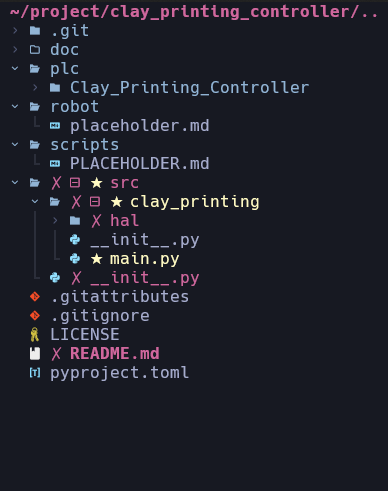

# **Clay Printing Controller**

This a repository for the Clay Printing Controller.

## Requirements

- [TwinCAT 3]

## Development

- TwinCAT: `v3.1 build4022.24`
- [UV]: A Blazing fast Python package management (in Rust)

### Getting Started

#### TwinCAT setup

Please find the document [HERE](https://docs.google.com/document/d/1gG2m832B31KaUyH_NmVh3YcKzGQiOX8l/edit?usp=drive_link&ouid=112329383900029899973&rtpof=true&sd=true).

Also, Check more information for reference from previous project [DCS Controller](https://github.com/USI-FMAA/digital_casting_system_controller)

#### Development environment

Create a virtual environment

``` bash
uv venv --python 3.12
source venv/bin/activate
uv pip install -e .
```
Run the main script

``` bash
uv run /src/clay_printing/main.py
```


We also can change to `venv`, but recommend to use `uv`.

``` bash
python3 -m venv .venv
source .venv/bin/activate
pip install -e .
```

## Package Information
> [!IMPORTANT]
> This is an initial repo structure, feel free to change it.

* `plc`: the TwinCAT project for the PLC controller.
* `robot`: the folder for the robot control.
* `script`: the example script for controlling Beckhoff controller via Python script.
- folder structure


> [!NOTE]
> The controller program class diagram is coming soon.

## Credits
Author: [Wei-Ting Chen]

This package was created by [Wei-Ting Chen] at [USI-FMAA](https://github.com/USI-FMAA).

<!-- link -->
[TwinCAT 3]: https://www.beckhoff.com/en-en/products/automation/twincat/texxxx-twincat-3-engineering/te1000.html
[UV]: https://docs.astral.sh/uv/
[Wei-Ting Chen]: https://github.com/WeiTing1991
