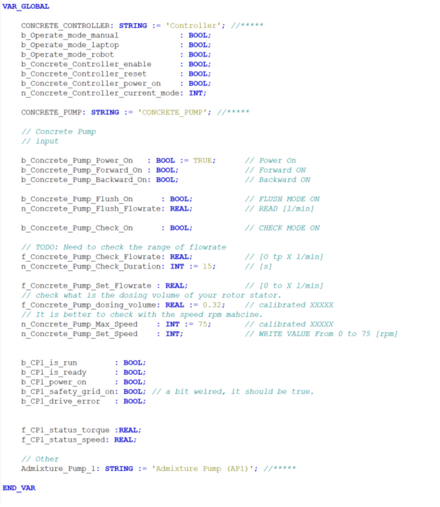

# Concrete Controller
## Steps
In TwinCAT, the entry file for control the controller parameter is `GVL_LAP`.

- Concrete controller enable : enable the controller
- Concrete pump forward On
- Set concrete pump speed

## TODO LIST
### safety
it is not implemented, this should base on the application.

### Concrete pump flowrate
In this steps, we have to check the spec that the dosing value from rotor stator.
and after enter the value in dosing volume(now it is 0.32)

### Concrete pump speed
In this case, we use the default settings
- motor max `speed 1500 rpm`
- pump max `speed 75 rpm` (after 20 gear change)
